# Trival - 智能旅游规划助手

> 基于 LangGraph 和 MCP 的多 Agent 协同旅游规划系统

[](https://www.python.org/)
[](https://vuejs.org/)
[](https://fastapi.tiangolo.com/)
[](https://langchain-ai.github.io/langgraph/)

## 📋 目录

- [项目简介](#项目简介)
- [核心功能](#核心功能)
- [界面展示](#界面展示)
- [技术架构](#技术架构)
- [工作流程](#工作流程)
- [快速开始](#快速开始)
- [配置说明](#配置说明)
- [API 文档](#api-文档)
- [项目结构](#项目结构)
- [开发指南](#开发指南)

---

<a id="项目简介"></a>
## 🎯 项目简介

Trival 是一个基于 **LangGraph** 构建的智能旅游规划助手，采用 **多 Agent 协同工作** 的架构。系统通过父 Agent 负责任务分发，子 Agent 负责具体工具调用，实现了智能化的旅游攻略生成。

### 核心特点

- 🤖 **多 Agent 协同**: 父 Agent 统筹调度，专业子 Agent 执行具体任务
- 🔄 **Plan-Execute-Replan 循环**: 智能规划、执行、优化的工作流程
- 👤 **人工介入机制**: LLM 自主判断是否需要用户补充信息
- 🎨 **反馈调整**: 用户可对生成的攻略提出反馈，系统自动调整
- 🔧 **MCP 工具集成**: 集成高德地图、12306、机票、天气、酒店等多种服务
- 📊 **智能消息压缩**: 自动压缩对话历史，保持上下文完整性
- 🎯 **补充执行机制**: 自动检测信息缺失并补充执行

---

<a id="核心功能"></a>
## ✨ 核心功能

### 1. 智能行程规划

根据用户需求（出发地、目的地、日期、人数、预算、偏好）自动生成详细的旅游攻略，包括：
- 🏨 **住宿推荐**: 根据预算和偏好推荐酒店
- 🚄 **交通方案**: 火车票、机票查询与比价
- 🌤️ **天气预报**: 目的地天气查询
- 🗺️ **景点推荐**: 热门景点和周边查询
- 🍽️ **美食推荐**: 当地特色餐厅和美食

### 2. 多 Agent 协同系统

**VSCode 用户提示**：如果下面的 Mermaid 图表未渲染，请安装 [Mermaid Preview 插件](https://marketplace.visualstudio.com/items?itemName=bierner.markdown-mermaid) 或 [Markdown Preview Mermaid Support 插件](https://marketplace.visualstudio.com/items?itemName=bierner.markdown-mermaid)

```mermaid
flowchart TD
    %% 父 Agent
    PARENT[🤖 父 Agent<br/>协调者 & 任务分发]

    %% 子 Agents
    TRANSPORT[🚄 交通助手<br/>火车票 & 机票查询]
    MAP[🗺️ 地图助手<br/>景点 & 路线规划]
    WEATHER[🌤️ 天气助手<br/>天气预报查询]
    HOTEL[🏨 酒店助手<br/>酒店搜索 & 价格]
    SEARCH[🔍 搜索助手<br/>互联网信息检索]
    FILE[📁 文件助手<br/>文件读写操作]

    %% 连接关系
    PARENT ==> TRANSPORT
    PARENT ==> MAP
    PARENT ==> WEATHER
    PARENT ==> HOTEL
    PARENT ==> SEARCH
    PARENT ==> FILE


    %% 样式
    classDef parentStyle fill:#ff6b6b,stroke:#c92a2a,stroke-width:3px,color:#fff
    classDef agentStyle fill:#4ecdc4,stroke:#0f9d58,stroke-width:2px,color:#fff

    class PARENT parentStyle
    class TRANSPORT,MAP,WEATHER,HOTEL,SEARCH,FILE agentStyle
```



**Agent 职责说明**：

| Agent | 功能描述 | 绑定的 MCP 工具 |
|-------|---------|----------------|
| **父 Agent** | 任务分析、分发、结果整合 | 无（仅协调） |
| **交通助手** | 12306 火车票、机票查询 | 12306-mcp, variflight-mcp |
| **地图助手** | POI 搜索、路线规划 | amap-maps |
| **天气助手** | 天气预报、气温查询 | mcp_tool |
| **酒店助手** | 酒店搜索、价格对比 | aigohotel-mcp |
| **搜索助手** | 互联网信息检索 | zhipu_search |
| **文件助手** | 文件读写、数据存储 | 本地文件系统 |

### 3. 人工介入机制

当 LLM 判断信息不足时，会自动暂停并请求用户补充：
- 💬 智能问题生成
- 🔘 可选选项 + 自定义输入
- 🔄 支持多轮交互
- 📝 记录问答历史

### 4. 反馈调整功能

用户对生成的攻略不满意时，可以：
- ✏️ 提出修改建议
- 🔄 系统自动调整相关部分
- 💾 保留未调整部分的完整信息

### 5. 补充执行机制

Replan 阶段会自动检测信息完整性：
- 🔍 按类别识别缺失信息
- 📋 生成补充任务列表
- 🔄 最多执行 2 轮补充循环
- ✅ 避免重复执行已完成任务

---

<a id="界面展示"></a>
## 🎨 界面展示

### 运行效果示例


**功能展示**：
- ✅ 智能表单输入（出发地、目的地、日期、人数、预算、偏好）
- 📊 实时进度显示
- 🎯 完整的旅游攻略生成（每日行程、交通、住宿、景点、美食等）
- 💰 预算明细分析
- 🔄 人工介入交互界面

---

<a id="技术架构"></a>
## 🏗️ 技术架构

### 后端技术栈

| 技术 | 版本 | 说明 |
|------|------|------|
| **Python** | 3.10+ | 核心开发语言 |
| **FastAPI** | Latest | 高性能 Web 框架 |
| **LangChain** | Latest | LLM 应用框架 |
| **LangGraph** | Latest | Agent 工作流编排 |
| **Pydantic** | Latest | 数据验证 |
| **Uvicorn** | Latest | ASGI 服务器 |

### 前端技术栈

| 技术 | 版本 | 说明 |
|------|------|------|
| **Vue** | 3.5+ | 渐进式 JavaScript 框架 |
| **Vite** | 7.1+ | 下一代前端构建工具 |
| **Element Plus** | 2.11+ | Vue 3 组件库 |
| **Vue Router** | 4.6+ | 官方路由管理器 |

### AI 能力

- 🧠 **LLM 模型**: 支持 OpenAI API 兼容接口
- 🔧 **MCP 协议**: Model Context Protocol 工具集成
- 📊 **结构化输出**: JsonOutputParser 格式化响应

---

<a id="工作流程"></a>
## 🔄 工作流程

### 整体流程图

```mermaid
flowchart TD
    %% 定义节点样式
    classDef startend fill:#2ecc71,stroke:#27ae60,stroke-width:3px,color:#fff
    classDef process fill:#3498db,stroke:#2980b9,stroke-width:2px,color:#fff
    classDef decision fill:#f39c12,stroke:#e67e22,stroke-width:2px,color:#fff
    classDef wait fill:#e74c3c,stroke:#c0392b,stroke-width:2px,color:#fff
    classDef loopStyle fill:#f8f9fa,stroke:#bdc3c7,stroke-width:2px,stroke-dasharray: 5 5

    %% 开始节点
    START([开始])

    %% 路由决策
    ROUTER{resume_router<br/>判断恢复点}

    %% Plan 阶段
    PLAN[/PLAN 生成任务规划/]

    %% Plan 人工介入检查
    CHECK_P{需要<br/>人工介入?}

    %% 等待用户响应 Plan
    WAIT_P[wait_user_plan<br/>⏸ 暂停等待]

    %% Execute 阶段
    EXECUTE[/EXECUTE 多Agent执行任务/]

    %% Replan 阶段
    REPLAN[/REPLAN 生成旅游攻略/]

    %% Replan 人工介入检查
    CHECK_R{需要<br/>人工介入?}

    %% 等待用户响应 Replan
    WAIT_R[wait_user_replan<br/>⏸ 暂停等待]

    %% 补充检查
    CHECK_S{需要<br/>补充执行?}

    %% 结束
    END([结束])

    %% 流程连接
    START --> ROUTER

    ROUTER -->|首次执行| PLAN
    ROUTER -.->|从Plan恢复| EXECUTE
    ROUTER -.->|从Replan恢复| CHECK_S

    PLAN --> CHECK_P
    CHECK_P -->|需要| WAIT_P
    CHECK_P -->|不需要| EXECUTE

    WAIT_P --> END

    EXECUTE --> REPLAN

    REPLAN --> CHECK_R
    CHECK_R -->|需要| WAIT_R
    CHECK_R -->|不需要| CHECK_S

    WAIT_R --> END

    CHECK_S -->|需要 且 count<2| EXECUTE
    CHECK_S -->|不需要 或 count≥2| END

    %% 应用样式
    class START,END startend
    class ROUTER,CHECK_P,CHECK_R,CHECK_S decision
    class PLAN,EXECUTE,REPLAN process
    class WAIT_P,WAIT_R wait

    %% 补充循环区域
    classDef regionStyle fill:#fff3cd,stroke:#ffc107,stroke-width:1px,stroke-dasharray: 5 5
```



**流程说明**：

1. **START → ROUTER**: 流程开始，进入路由决策
2. **ROUTER → PLAN**: 首次执行，进入 Plan 阶段
3. **PLAN → CHECK_P**: 生成规划后，检查是否需要人工介入
4. **CHECK_P → WAIT_P**: 需要介入，暂停等待用户响应
5. **CHECK_P → EXECUTE**: 不需要介入，直接执行
6. **EXECUTE → REPLAN**: 执行完成后进入 Replan
7. **REPLAN → CHECK_R**: 检查是否需要人工介入
8. **CHECK_R → WAIT_R**: 需要介入，暂停等待
9. **CHECK_R → CHECK_S**: 不需要介入，检查是否需要补充
10. **CHECK_S → EXECUTE**: 需要补充且未达上限，返回 Execute（补充循环）
11. **CHECK_S → END**: 不需要补充或已达上限，流程结束
12. **用户响应后**: 从 WAIT_P/WAIT_R 恢复，通过 ROUTER 重新进入相应阶段

### 核心节点说明

#### 1. **PLAN** - 规划节点
- 功能：根据用户需求生成结构化的任务规划
- 输出：`overview`（概述步骤）+ `actionable_tasks`（可执行任务）
- 特色：
  - 支持正常模式和反馈调整模式
  - 智能人工介入判断
  - 消息历史压缩（最多保留 15 条）

#### 2. **EXECUTE** - 执行节点
- 功能：父 Agent 协调子 Agent 按类别执行任务
- 子 Agent 类型：
  - `transport`: 交通助手（火车票、机票）
  - `map`: 地图助手（景点、路线）
  - `weather`: 天气助手（天气、气温）
  - `hotel`: 酒店助手（酒店查询）
  - `search`: 搜索助手（互联网搜索）
  - `file`: 文件助手（文件操作）
- 特色：
  - 按类别组织任务
  - 自动避免重复执行
  - 查询任务与总结任务分离

#### 3. **REPLAN** - 优化节点
- 功能：基于执行结果生成完整的旅游攻略
- 输出：结构化的旅游信息（天气、交通、住宿、景点、美食等）
- 特色：
  - 支持数据合并策略（反馈模式）
  - 智能判断是否需要补充执行
  - 按类别生成补充任务

#### 4. **OBSERVATION** - 观察节点(暂废除)
- 功能：判断攻略是否满足用户需求
- 输出：满意度判断 + 缺失项分析
- 状态：已废弃（使用 check_supplement 替代）

#### 5. **CHECK_SUPPLEMENT** - 补充检查节点
- 功能：决定是否需要补充执行
- 逻辑：
  - `need_supplement=False` → 流程结束
  - `need_supplement=True` 且 `supplement_count < 2` → 执行补充
  - `supplement_count >= 2` → 强制结束

---

<a id="快速开始"></a>
## 🚀 快速开始

### 环境要求

- Python 3.10+
- Node.js 16+
- npm 或 yarn

### 1. 克隆项目

```bash
git clone <repository_url>
cd Trival
```

### 2. 后端配置

#### 安装依赖

```bash
cd backend
pip install fastapi uvicorn langchain langgraph pydantic python-dotext
```

#### 配置环境变量

编辑 `backend/.env` 文件：

```env
# LLM 模型配置
MODEL_NAME=gpt-5-mini
MODEL_API_KEY=your-api-key-here
MODEL_BASE_URL=https://api.openai.com/v1

# MCP 服务 URL 配置
# 获取方式：访问对应的 MCP 服务器页面，复制 "SSE 推理地址" 或 "HTTP 推理地址"
MCP_AMAP_URL=your-url
MCP_12306_URL=your-url
MCP_VARIFLIGHT_URL=your-url
MCP_WEATHER_URL=your-url
AIGOHOTEL-MCP-KEY=Bearer your-hotel-mcp-key
ZHIPU_SEARCH=your-search-key
```

**MCP 服务获取地址**（点击访问对应服务页面）：

| MCP 服务 | 功能描述 | 获取地址 |
|---------|---------|---------|
| **高德地图** | POI搜索、路线规划 | [amap-maps](https://www.modelscope.cn/mcp/servers/@amap/amap-maps) |
| **12306火车票** | 火车票查询 | [12306-mcp](https://www.modelscope.cn/mcp/servers/@Joooook/12306-mcp) |
| **航班查询** | 机票查询 | [Variflight-MCP](https://www.modelscope.cn/mcp/servers/@variflight-ai/variflight-mcp) |
| **天气查询** | 天气预报 | [mcp_tool](https://www.modelscope.cn/mcp/servers/@MrCare/mcp_tool) |
| **酒店查询** | 酒店搜索 | [AI_Go_Hotel_MCP](https://www.modelscope.cn/mcp/servers/yorklu/AI_Go_Hotel_MCP) |
| **智谱搜索** | 互联网搜索 | [智谱AI文档](https://docs.bigmodel.cn/cn/guide/tools/web-search) |

**获取 MCP URL 步骤**：
1. 点击上表中的对应服务链接
2. 在 MCP 服务页面找到 **"SSE 推理地址"** 或 **"HTTP 推理地址"**
3. 复制该地址到 `.env` 文件的对应变量中
4. 对于需要认证的服务（如酒店、搜索），还需复制 API Key

#### 启动后端

```bash
# 开发模式（支持热重载）
cd backend
uvicorn app:app --reload --host 0.0.0.0 --port 8000

# 或直接运行
python backend/app.py
```

后端将在 `http://localhost:8000` 启动

### 3. 前端配置

#### 安装依赖

```bash
cd fronted
npm install
```

#### 配置环境变量（可选）

编辑 `fronted/.env` 文件：

```env
VITE_API_BASE=http://localhost:8000
```

#### 启动前端

```bash
cd fronted
npm run dev
```

前端将在 `http://localhost:5173` 启动

### 4. 访问应用

打开浏览器访问：**http://localhost:5173**

---

<a id="配置说明"></a>
## ⚙️ 配置说明

### MCP 服务配置

配置文件位置：`backend/config/mcp.py`

```python
trival_mcp_config = {
    # 高德地图 - POI搜索、路线规划
    "amap-maps": {
        "transport": "sse",
        "url": os.getenv("MCP_AMAP_URL"),
        "disabled_tools": []
    },
    # 12306火车票查询
    "12306-mcp": {
        "transport": "streamable_http",
        "url": os.getenv("MCP_12306_URL"),
        "disabled_tools": []
    },
    # 机票查询
    "variflight-mcp": {
        "transport": "sse",
        "url": os.getenv("MCP_VARIFLIGHT_URL"),
        "disabled_tools": []
    },
    # 天气查询
    "mcp_tool": {
        "transport": "sse",
        "url": os.getenv("MCP_WEATHER_URL"),
        "disabled_tools": []
    },
    # 酒店查询
    "aigohotel-mcp": {
        "url": "https://mcp.aigohotel.com/mcp",
        "transport": "streamable_http",
        "headers": {
            "Authorization": os.getenv("AIGOHOTEL-MCP-KEY"),
            "Content-Type": "application/json"
        },
        "disabled_tools": []
    }
}

# MCP 服务器到 Agent 类型的映射
mcp_to_agent_mapping = {
    "12306-mcp": "transport",
    "variflight-mcp": "transport",
    "mcp_tool": "weather",
    "amap-maps": ["map"],
    "aigohotel-mcp": ["hotel"]
}
```

### 子 Agent 配置

配置文件位置：`backend/config/sub_agent_config.py`

```python
SUB_AGENT_MAX_ROUNDS = {
    "transport": 1,    # 交通助手（机票1轮，火车2轮）
    "map": 2,          # 地图助手
    "search": 2,       # 搜索助手
    "file": 2,         # 文件助手
    "weather": 1,      # 天气助手
    "hotel": 2,        # 酒店助手
}

# Replan → Execute 补充循环的最大次数
MAX_REPLAN_SUPPLEMENT_ROUNDS = 2
```

### 模型配置

| 节点 | 推荐模型 | 说明 |
|------|----------|------|
| **plan** | GPT-5-mini | 规划生成 |
| **execute** | GPT-5-mini | 任务分发（父Agent） |
| **replan** | GPT-4.1 | 长上下文攻略生成 |
| **sub-agents** | GPT-5-mini | 子Agent执行 |

---

<a id="api-文档"></a>
## 📡 API 文档

### 1. 开始旅游规划

**端点**: `POST /travel`

**请求体**:

```json
{
  "origin": "沈阳",
  "destination": "长沙",
  "date": "2026-01-02",
  "days": 4,
  "people": 1,
  "budget": 5000,
  "preferences": "我要坐飞机往返。在规划时，始终都不需要考虑总的预算问题，只需要给出规划即可。"
}
```

**响应**:

```json
{
  "session_id": "f6be9566-8d3c-4d0d-a67a-e8ce8386b5e2",
  "status": "completed",
  "need_intervention": false,
  "amusement_info": {
    "destination": "长沙",
    "travel_dates": "2026-01-02 至 2026-01-05",
    "duration": 4,
    "summary": "本次行程为沈阳出发，4天3晚长沙深度游，单人出行，往返均为飞机。精选市中心高性价比酒店，涵盖岳麓山、岳麓书院、橘子洲、湖南省博物馆等长沙必打卡景点，体验地道湘菜与夜市，兼顾文化、自然与美食。全程地铁/打车便捷衔接，适合首次或深度游长沙的旅客。",
    "highlights": [
      "岳麓山+岳麓书院文化与自然一体深度体验",
      "橘子洲头江景与伟人雕塑打卡",
      "湖南省博物馆马王堆汉墓国宝展",
      "火宫殿、文和友、夜市等地道湘菜与小吃",
      "解放西/云玺潮汇酒吧夜生活"
    ],
    "daily_itinerary": [
      {
        "day": 1,
        "date": "2026-01-02",
        "morning": "搭乘NS3295航班（07:55沈阳桃仙-11:25长沙黄花，经济舱约670元），抵达长沙黄花机场。建议乘地铁6号线或打车前往市区酒店，办理入住或寄存行李。",
        "afternoon": "前往坡子街/太平街历史街区，步行游览长沙老街风情，体验地道小吃。推荐在火宫殿（坡子街127号）品尝臭豆腐、糖油粑粑等。",
        "evening": "逛黄兴南路步行街，体验长沙夜市氛围。可前往南门口夜市（17:00-01:00）夜宵，或解放西/云玺潮汇酒吧体验长沙夜生活。",
        "meals": [
          "午餐：坡子街美食城/火宫殿",
          "晚餐：南门口夜市/文和友"
        ],
        "pois": [
          {"name": "坡子街美食城", "type": "餐厅", "address": "坡子街115号"},
          {"name": "火宫殿", "type": "餐厅", "address": "坡子街127号"},
          {"name": "黄兴南路步行商业街", "type": "购物", "address": "黄兴南路383号"},
          {"name": "南门口夜市", "type": "夜市", "address": "百花村巷与学院街交叉口东40米"}
        ]
      }
    ],
    "transportation": {
      "outbound_flights": [
        {"flight_number": "NS3295", "date": "2026-01-02", "departure": "07:55", "arrival": "11:25", "price": "670元"}
      ],
      "return_flights": [
        {"flight_number": "NS3296", "date": "2026-01-05", "departure": "18:20", "arrival": "21:30", "price": "720元"}
      ],
      "local_transport": "地铁6号线（黄花机场-市区）、出租车/网约车"
    },
    "accommodation": [
      {
        "name": "长沙国金中心亚朵酒店",
        "location": "芙蓉区芙蓉中路二段38号",
        "price_range": "350-450元/晚",
        "rating": "4.7分",
        "highlights": "市中心位置，近黄兴路步行街，交通便捷"
      }
    ],
    "weather": {
      "forecast": "2026-01-02至01-05长沙天气：多云为主，气温8-18℃，体感较凉，建议携带厚外套"
    },
    "attractions": [
      {"name": "岳麓山风景名胜区", "type": "景点", "address": "登高路58号"},
      {"name": "橘子洲风景名胜区", "type": "景点", "address": "橘子洲头2号"},
      {"name": "湖南省博物馆", "type": "博物馆", "address": "东风路50号"}
    ],
    "restaurants": [
      {"name": "火宫殿", "type": "湘菜", "address": "坡子街127号"},
      {"name": "文和友", "type": "湘菜", "address": "湘江中路36号"}
    ],
    "budget_breakdown": {
      "transportation": "约1390元（往返机票）",
      "accommodation": "约1200元（3晚）",
      "food": "约600元",
      "attractions": "约150元",
      "total": "约3340元"
    }
  }
}
```

### 2. 恢复规划流程

**端点**: `POST /resume`

**请求体**:

```json
{
  "session_id": "uuid-string",
  "intervention_response": {
    "text_input": "用户自定义输入",
    "selected_options": ["选项1", "选项2"]
  }
}
```

### 3. 提交反馈调整

**端点**: `POST /feedback`

**请求体**:

```json
{
  "session_id": "uuid-string",
  "feedback": "希望增加更多博物馆推荐"
}
```

---

<a id="项目结构"></a>
## 📁 项目结构

```
Trival/
├── backend/                      # 后端目录
│   ├── app.py                    # FastAPI 应用入口
│   ├── logging_config.py         # 日志配置
│   ├── main.py                   # 主程序入口
│   │
│   ├── agent/                    # Agent 相关
│   │   ├── amusement_agent.py    # 主 Agent 工作流
│   │   └── sub_agents.py         # 子 Agent 定义
│   │
│   ├── api/                      # API 路由
│   │   ├── trival.py             # 旅游规划 API
│   │   └── model/
│   │       └── trival_model.py   # 数据模型
│   │
│   ├── config/                   # 配置文件
│   │   ├── __init__.py
│   │   ├── mcp.py                # MCP 服务配置
│   │   └── sub_agent_config.py   # 子 Agent 配置
│   │
│   ├── formatters/               # 输出格式化
│   │   ├── amusement_format.py   # 旅游信息格式
│   │   ├── hotel_format.py       # 酒店格式
│   │   └── tool_format.py        # 工具格式
│   │
│   ├── prompts/                  # Prompt 模板
│   │   ├── __init__.py
│   │   └── amusement_prompt.py   # 旅游相关 Prompt
│   │
│   └── utils/                    # 工具函数
│       ├── __init__.py
│       ├── agent_tools.py        # Agent 工具函数
│       ├── mcp_manager.py        # MCP 管理器
│       ├── mcp_tools.py          # MCP 工具
│       ├── tool_data_storage.py  # 工具数据存储
│       └── tools.py              # 其他工具
│
├── fronted/                      # 前端目录
│   ├── src/
│   │   ├── components/           # Vue 组件
│   │   │   ├── TravelAssistant.vue  # 主界面
│   │   │   ├── Login.vue         # 登录组件
│   │   │   └── Register.vue      # 注册组件
│   │   ├── services/
│   │   │   └── api.js            # API 调用
│   │   ├── App.vue               # 根组件
│   │   └── main.js               # 入口文件
│   ├── package.json              # 前端依赖
│   └── vite.config.js            # Vite 配置
│
├── .env                          # 环境变量（后端）
├── README.md                     # 项目文档
└── 启动指南.md                   # 启动指南
```

---

<a id="开发指南"></a>
## 🛠️ 开发指南

### 添加新的 MCP 服务

1. 在 `backend/.env` 添加 MCP URL
2. 在 `backend/config/mcp.py` 添加服务配置
3. 在 `mcp_to_agent_mapping` 添加映射关系

### 添加新的子 Agent

1. 在 `backend/agent/sub_agents.py` 创建新的 Agent 类
2. 在 `backend/config/sub_agent_config.py` 添加配置
3. 在 `backend/prompts/amusement_prompt.py` 添加对应 Prompt

### 修改 Agent 工作流

工作流定义在 `backend/agent/amusement_agent.py` 的 `get_graph()` 函数中。

### 日志调试

日志文件位置：`backend/logs/`

日志级别配置：`backend/logging_config.py`

---

## 🎯 特色技术点

### 1. 智能消息压缩

在 Plan 和 Replan 阶段，系统会自动压缩消息历史：
- 保留所有 ToolMessage（工具调用结果）
- 保留最近的 N 条其他消息
- 使用 LLM 总结早期消息

### 2. 人工介入机制

LLM 自主判断是否需要用户补充信息：
- 在 `PlanWithIntervention` 和 `ReplanWithIntervention` 格式中定义介入逻辑
- 支持多轮交互，记录问答历史
- 避免重复提问

### 3. 反馈调整数据合并

在反馈模式下，系统会智能合并原始数据和调整数据：
- 空值字段优先使用原始数据
- 内容较少时保留更丰富的原始数据
- 深度合并复杂字段（如 transportation、accommodation）

### 4. 任务类别化管理

Plan 阶段生成的任务按类别组织：
```json
{
  "actionable_tasks": [
    {
      "category": "weather",
      "tasks": ["查询目的地天气"],
      "summary_task": "总结天气信息"
    },
    {
      "category": "transport",
      "tasks": ["查询火车票", "查询机票"],
      "summary_task": "对比交通方案"
    }
  ]
}
```

### 5. 工具执行数据存储

每个类别的工具调用结果会存储在 `ToolDataStorage` 中，供后续任务使用：

```python
# 存储数据
storage.store(category="transport", data={"tickets": [...]})

# 获取数据
data = storage.get(category="transport")
```

---

## 📝 常见问题

### Q1: 如何更换 LLM 模型？

编辑 `backend/.env` 中的 `MODEL_NAME`、`MODEL_API_KEY` 和 `MODEL_BASE_URL`。

### Q2: MCP 服务连接失败怎么办？

1. 检查 `backend/.env` 中的 MCP URL 是否正确
2. 检查网络连接
3. 查看后端日志了解具体错误

### Q3: 如何调整子 Agent 的最大轮次？

编辑 `backend/config/sub_agent_config.py` 中的 `SUB_AGENT_MAX_ROUNDS`。

### Q4: 前端无法连接后端？

1. 确认后端已启动（访问 `http://localhost:8000/api`）
2. 检查 `fronted/src/services/api.js` 中的 `API_BASE` 配置
3. 检查 CORS 配置（`backend/app.py`）

### Q5: 如何禁用某个 MCP 工具？

在 `backend/config/mcp.py` 中对应服务的 `disabled_tools` 列表添加工具名称。

---

## 🤝 贡献指南

欢迎提交 Issue 和 Pull Request！

---

## 📄 许可证

MIT License

---

## 👥 作者

- xlxllup - Initial work

---

## 🙏 致谢

- [LangChain](https://github.com/langchain-ai/langchain) - 强大的 LLM 应用框架
- [LangGraph](https://github.com/langchain-ai/langgraph) - Agent 工作流编排
- [FastAPI](https://fastapi.tiangolo.com/) - 现代化的 Python Web 框架
- [Vue.js](https://vuejs.org/) - 渐进式 JavaScript 框架
- [ModelScope](https://modelscope.cn/) - MCP 服务托管平台
